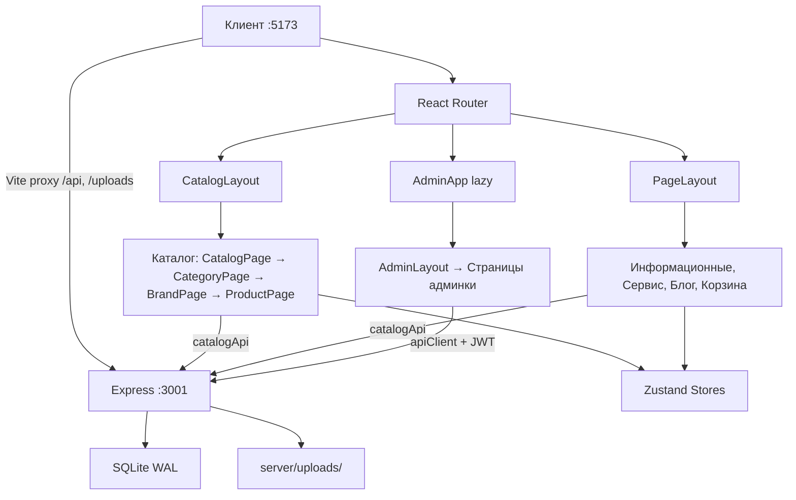

# Архитектура

## Стек

| Слой | Технологии |
|------|-----------|
| Витрина | React 19 + Vite 7 + Tailwind CSS 3 + React Router 7 + Zustand 5 |
| Бэкенд | Express 5 + better-sqlite3 + JWT (bcryptjs + jsonwebtoken) |
| Админка | React + react-hot-toast + @dnd-kit + @tiptap/react |

## Поток данных



## Файловая структура

```
src/
├── App.jsx                 # Роутинг (Routes)
├── main.jsx                # BrowserRouter, точка входа
├── index.css               # Tailwind + кастомные классы
├── assets/                 # Изображения, шрифты
├── components/
│   ├── ui/                 # Button, Modal, Tabs, Badge, Toast, Skeleton...
│   ├── Header/             # Header, TopBar, Navigation, MobileMenu
│   ├── Footer/             # Footer, FooterColumn, FooterSubscribe...
│   ├── Hero/               # Главный баннер
│   ├── Categories/         # Секция категорий
│   ├── ProductCard/        # Карточки товаров на главной
│   ├── Benefits/           # Преимущества
│   ├── News/               # Новости
│   ├── FAQ/                # FAQ-аккордеон
│   ├── AboutUs/            # О нас
│   ├── ContactSection/     # Контакты
│   ├── InfoBlocks/         # Информационные блоки
│   ├── catalog/            # ProductGrid, ProductListCard, SortDropdown
│   ├── product/            # ColorSelector, MemorySelector, Gallery, Config...
│   ├── filters/            # FilterSidebar, CheckboxFilter, ColorFilter...
│   ├── search/             # SearchInput, SearchDropdown
│   ├── cart/               # CartItem, CartRecommendations
│   ├── seo/                # JSON-LD компоненты
│   ├── Service/            # Компоненты страницы сервиса
│   ├── ScrollToTop.jsx     # Скролл при навигации
│   └── ErrorBoundary.jsx   # Обработка ошибок React
├── data/                   # Статические данные, конфиг, товары
│   ├── config.js           # CONTACTS, COMPANY
│   ├── navigation.js       # NAV_MAIN, NAV_MOBILE, FOOTER_SECTIONS
│   ├── categories.js       # CATEGORIES
│   ├── constants.js        # PRICE, SORT_OPTIONS
│   ├── benefits.js         # Преимущества
│   ├── faq.js              # FAQ-данные
│   ├── infoPages.js        # Информационные страницы
│   ├── news.js             # Новости
│   ├── redirects.js        # Редиректы со старых URL
│   ├── service.js          # Данные сервиса
│   └── products/           # iphone.js, mac.js, samsung.js, dyson.js, used.js
├── hooks/                  # useProductVariant, useDebounce, useCatalogQuery...
├── services/
│   ├── catalogApi.js       # Публичный API (/api/public/*)
│   ├── productMapper.js    # snake_case → camelCase маппинг
│   └── api.js              # Отправка форм (заявки, обратная связь)
├── utils/
│   ├── product.js          # formatPrice, getMinPrice, hasDiscount...
│   ├── color.js            # isLightColor(hex)
│   └── pluralize.js        # pluralize(count, forms)
├── stores/                 # Zustand: cart, products, search, toast, recentlyViewed
├── layouts/
│   ├── CatalogLayout.jsx   # Header + Outlet + Footer + ErrorBoundary
│   └── PageLayout.jsx      # Header + children + Footer
├── pages/
│   ├── Home.jsx
│   ├── catalog/            # CatalogPage, CategoryPage, BrandPage, ProductPage
│   ├── info/               # InfoPage, AboutPage
│   ├── blog/               # BlogPage, BlogPostPage
│   ├── cart/               # CartPage
│   ├── service/            # ServicePage
│   ├── used/               # UsedPage
│   ├── SearchPage.jsx
│   └── NotFoundPage.jsx
└── admin/                  # Админка (lazy-loaded)
    ├── AdminApp.jsx        # Роутинг админки
    ├── AdminLayout.jsx     # Sidebar + Header + Outlet
    ├── hooks/              # useAuth, useQuery, useMutation, useImageUpload
    ├── services/           # apiClient, bannerService, productService...
    ├── components/         # DataTable, ImageUploader, VariantMatrix...
    ├── utils/              # generateSlug
    └── pages/              # Login, Dashboard, Products, Blog, Requests, Services...

server/
├── index.js                # Express, CORS, middleware, маршруты
├── db.js                   # SQLite подключение + миграции (14 таблиц)
├── auth.js                 # JWT middleware (verifyToken, signToken)
├── seed.js                 # Заполнение БД из src/data/
├── routes/
│   ├── auth.js             # POST /api/auth/login, GET /api/auth/me
│   ├── public.js           # GET /api/public/* (категории, товары, поиск)
│   ├── products.js         # CRUD товаров + вариантов
│   ├── categories.js       # CRUD категорий + reorder
│   ├── banners.js          # CRUD баннеров + reorder
│   ├── blog.js             # CRUD статей
│   ├── requests.js         # Заявки (POST публичный, GET/PUT protected)
│   ├── brands.js           # GET /api/brands (список брендов)
│   ├── services.js         # CRUD /api/services (услуги + цены)
│   ├── upload.js           # POST multer (jpg/png/webp/gif, 5MB)
│   └── dashboard.js        # GET /api/dashboard/stats
├── uploads/                # Загруженные файлы
│   ├── products/
│   ├── banners/
│   ├── blog/
│   └── categories/
└── data/
    └── store.db            # SQLite (автосоздание, в .gitignore)

docs/
├── COMPONENTS.md           # Полное описание компонентов с props
├── HOOKS.md                # Документация хуков
├── ARCHITECTURE.md         # Этот файл
├── API.md                  # API эндпоинты с примерами
├── DATABASE.md             # Схема БД
├── STORES.md               # Zustand stores
├── CONVENTIONS.md          # Код-стайл и паттерны
├── TROUBLESHOOTING.md      # Решение проблем
└── DEPLOYMENT.md           # Сборка и деплой
```

## Лейауты

### CatalogLayout (`src/layouts/CatalogLayout.jsx`)

Обёртка для каталога: `Header → ErrorBoundary → Outlet → Footer`. Используется для вложенных маршрутов каталога.

### PageLayout (`src/layouts/PageLayout.jsx`)

Обёртка для остальных страниц: `Header → children → Footer`. Принимает `className` для кастомизации `<main>`.

## Роутинг

Порядок маршрутов в `App.jsx`:

```
/                         → Home (синхронный)
/catalog/*                → CatalogLayout + вложенные маршруты (синхронные)
/search                   → SearchPage (lazy)
/cart                     → CartPage (lazy)
/service                  → ServicePage (lazy)
/used                     → UsedPage (lazy)
/about                    → AboutPage (lazy)
/blog                     → BlogPage (lazy)
/blog/:id                 → BlogPostPage (синхронный)
/admin/*                  → AdminApp (lazy)
/:slug                    → InfoPage (синхронный, catch-all для инфо-страниц)
*                         → NotFoundPage (lazy)
```

Каталог и Home — синхронные (часто посещаемые). Остальное — `lazy()` с `<Suspense>` и page-specific скелетами:

| Роут | Скелет |
|------|--------|
| `/search` | `SearchPageSkeleton` — breadcrumbs + grid 2×3 карточек |
| `/cart` | `CartPageSkeleton` — title + 2/3 товары + 1/3 sidebar |
| `/service` | `ServicePageSkeleton` — hero + 2 колонки + прайс |
| `/used` | `UsedPageSkeleton` — hero-banner + sidebar + grid |
| `/blog` | `BlogPageSkeleton` — title + grid статей (aspect 2:1) |
| `/about` | `AboutPageSkeleton` — 2 колонки + 4 feature-карточки |
| `/admin/*` | `null` (свой Loader внутри AdminApp) |
| `*` (404) | `null` (крохотный чанк) |

Все скелеты обёрнуты в `PageLayout` — Header и Footer видны сразу при загрузке.

Редиректы со старых URL — через `REDIRECTS` из `src/data/redirects.js`.

## Дизайн-система

### Шрифты

| Назначение | Шрифт |
|-----------|-------|
| Основной текст | Inter, system-ui, sans-serif |
| Заголовки (h1-h6) | Unbounded, sans-serif |

### Цвета Tailwind

| Token | Hex | Применение |
|-------|-----|-----------|
| `gray-light` | #f5f5f7 | Фон карточек, секций |
| `gray-medium` | #86868b | Вторичный текст |
| `gray-dark` | #1d1d1f | Основной текст |

### Border Radius

| Token | Значение | Применение |
|-------|---------|-----------|
| `liquid` | 20px | Карточки |
| `liquid-lg` | 28px | Большие карточки |
| `card` | 16px | Стандартные карточки |
| `btn` | 12px | Кнопки |
| `input` | 12px | Инпуты |

### Тени

| Token | Применение |
|-------|-----------|
| `glass` | Стандартная glassmorphism-тень |
| `glass-hover` | Hover-состояние |
| `liquid` | Liquid glass с inset |
| `liquid-hover` | Hover liquid glass |

### Кастомные CSS-классы (`index.css`)

| Класс | Описание |
|-------|---------|
| `.liquid-glass` | Glassmorphism: белый фон 72%, blur 20px |
| `.liquid-glass-clear` | Прозрачный glassmorphism |
| `.liquid-glass-dark` | Тёмный glassmorphism |
| `.liquid-glass-scrolled` | Усиленный при скролле |
| `.liquid-glass-form` | Для форм поверх изображений |
| `.card-hover` | Hover: shadow + scale 1.02 |
| `.nav-link` | Ссылка навигации |
| `.section-padding` | `px-6 lg:px-60` |
| `.section-margin` | `mx-6 lg:mx-60` |
| `.text-fluid-2xl/xl/lg` | Fluid typography (clamp) |
| `.scrollbar-hide` | Скрыть скроллбар |
| `.input-dark` | Тёмный underline-инпут |

### Анимации

| Token | Описание |
|-------|---------|
| `fade-in-up` | Появление снизу |
| `shimmer` | Скелетон-анимация |
| `scale-in` | Масштабирование |
| `ripple` | Ripple-эффект кнопок |
| `pulse-soft` | Мягкая пульсация |

### Брейкпоинты

| Брейкпоинт | Размер |
|-----------|--------|
| `xs` | 375px |
| `sm` | 640px (Tailwind default) |
| `md` | 768px |
| `lg` | 1024px (основной) |
| `xl` | 1280px |

Mobile-first подход. Основной брейкпоинт — `lg:` (1024px).

## Паттерны данных

### Витрина

```
Компонент → catalogApi.getProducts() → /api/public/products
                                           ↓
                                    JSON (snake_case)
                                           ↓
                               productMapper.mapProducts()
                                           ↓
                                  Данные (camelCase) → Компонент
```

### Админка

```
Компонент → useQuery('/api/products') → apiClient.get() → JWT header
                                              ↓
                                         JSON response
                                              ↓
                                    Компонент (данные как есть)

Компонент → useMutation('POST', '/api/products') → apiClient.post() → JWT
                                                          ↓
                                                   react-hot-toast
```
