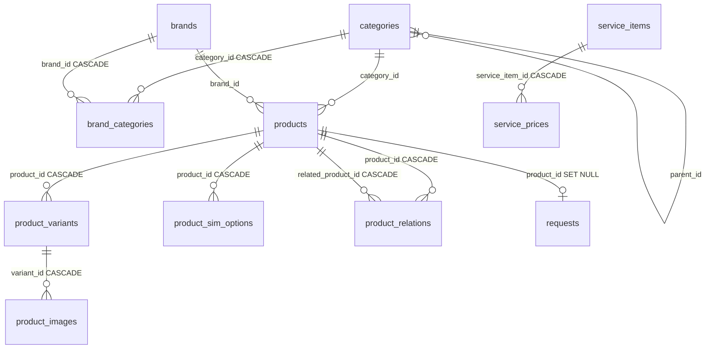

# База данных

SQLite через better-sqlite3. Файл: `server/data/store.db` (автосоздание, в .gitignore).

## Подключение

```sql
PRAGMA journal_mode = WAL;
PRAGMA foreign_keys = ON;
```

## Таблицы

### admin_users

| Колонка | Тип | Ограничения |
|---------|-----|------------|
| id | INTEGER | PRIMARY KEY AUTOINCREMENT |
| email | TEXT | UNIQUE NOT NULL |
| password_hash | TEXT | NOT NULL (bcrypt) |
| name | TEXT | |
| created_at | TEXT | DEFAULT datetime('now') |

### categories

| Колонка | Тип | Ограничения |
|---------|-----|------------|
| id | INTEGER | PRIMARY KEY AUTOINCREMENT |
| parent_id | INTEGER | REFERENCES categories(id) |
| name | TEXT | NOT NULL |
| slug | TEXT | UNIQUE NOT NULL |
| description | TEXT | |
| image_url | TEXT | |
| sort_order | INTEGER | DEFAULT 0 |
| active | INTEGER | DEFAULT 1 |
| created_at | TEXT | DEFAULT datetime('now') |
| updated_at | TEXT | DEFAULT datetime('now') |

### brands

| Колонка | Тип | Ограничения |
|---------|-----|------------|
| id | INTEGER | PRIMARY KEY AUTOINCREMENT |
| name | TEXT | NOT NULL |
| slug | TEXT | UNIQUE NOT NULL |
| logo_url | TEXT | |
| sort_order | INTEGER | DEFAULT 0 |
| active | INTEGER | DEFAULT 1 |

### brand_categories

| Колонка | Тип | Ограничения |
|---------|-----|------------|
| id | INTEGER | PRIMARY KEY AUTOINCREMENT |
| brand_id | INTEGER | NOT NULL REFERENCES brands(id) ON DELETE CASCADE |
| category_id | INTEGER | NOT NULL REFERENCES categories(id) ON DELETE CASCADE |
| display_name | TEXT | Отображаемое имя (iPhone, Mac, iPad...) |
| sort_order | INTEGER | DEFAULT 0 |
| | | UNIQUE(brand_id, category_id) |

### products

| Колонка | Тип | Ограничения |
|---------|-----|------------|
| id | INTEGER | PRIMARY KEY AUTOINCREMENT |
| category_id | INTEGER | NOT NULL REFERENCES categories(id) |
| brand_id | INTEGER | NOT NULL REFERENCES brands(id) |
| name | TEXT | NOT NULL |
| slug | TEXT | UNIQUE NOT NULL |
| short_description | TEXT | |
| description | TEXT | |
| badges | TEXT | DEFAULT '[]' (JSON: new, hit, sale) |
| specs | TEXT | DEFAULT '{}' (JSON) |
| is_used | INTEGER | DEFAULT 0 |
| condition | TEXT | perfect, excellent, good |
| condition_label | TEXT | |
| warranty | TEXT | |
| dimensions | TEXT | DEFAULT '[]' (JSON: массив измерений) |
| sort_order | INTEGER | DEFAULT 0 |
| active | INTEGER | DEFAULT 1 |
| created_at | TEXT | DEFAULT datetime('now') |
| updated_at | TEXT | DEFAULT datetime('now') |

### product_variants

| Колонка | Тип | Ограничения |
|---------|-----|------------|
| id | INTEGER | PRIMARY KEY AUTOINCREMENT |
| product_id | INTEGER | NOT NULL REFERENCES products(id) ON DELETE CASCADE |
| color_name | TEXT | NOT NULL |
| color_hex | TEXT | NOT NULL |
| memory | INTEGER | NULL для товаров без памяти |
| price | INTEGER | NOT NULL (в рублях) |
| old_price | INTEGER | Для скидок |
| stock_status | TEXT | DEFAULT 'in_stock' CHECK(stock_status IN ('in_stock','on_order','out_of_stock')) |
| sim_id | TEXT | NULL (связь, миграция из SIM-опций) |
| sim_name | TEXT | NULL |
| attributes | TEXT | DEFAULT '{}' (JSON: произвольные атрибуты варианта) |
| sort_order | INTEGER | DEFAULT 0 |
| created_at | TEXT | DEFAULT datetime('now') |

### product_images

| Колонка | Тип | Ограничения |
|---------|-----|------------|
| id | INTEGER | PRIMARY KEY AUTOINCREMENT |
| variant_id | INTEGER | NOT NULL REFERENCES product_variants(id) ON DELETE CASCADE |
| url | TEXT | NOT NULL |
| sort_order | INTEGER | DEFAULT 0 |

### product_sim_options

| Колонка | Тип | Ограничения |
|---------|-----|------------|
| id | INTEGER | PRIMARY KEY AUTOINCREMENT |
| product_id | INTEGER | NOT NULL REFERENCES products(id) ON DELETE CASCADE |
| sim_id | TEXT | NOT NULL (dual, esim) |
| name | TEXT | NOT NULL (nanoSIM + eSIM) |
| price_modifier | INTEGER | DEFAULT 0 |
| sort_order | INTEGER | DEFAULT 0 |

### product_relations

| Колонка | Тип | Ограничения |
|---------|-----|------------|
| product_id | INTEGER | NOT NULL REFERENCES products(id) ON DELETE CASCADE |
| related_product_id | INTEGER | NOT NULL REFERENCES products(id) ON DELETE CASCADE |
| | | PRIMARY KEY(product_id, related_product_id) |

### banners

| Колонка | Тип | Ограничения |
|---------|-----|------------|
| id | INTEGER | PRIMARY KEY AUTOINCREMENT |
| title | TEXT | |
| image_desktop | TEXT | NOT NULL |
| image_mobile | TEXT | NOT NULL |
| alt | TEXT | |
| link | TEXT | |
| active | INTEGER | DEFAULT 1 |
| sort_order | INTEGER | DEFAULT 0 |
| created_at | TEXT | DEFAULT datetime('now') |
| updated_at | TEXT | DEFAULT datetime('now') |

### blog_posts

| Колонка | Тип | Ограничения |
|---------|-----|------------|
| id | INTEGER | PRIMARY KEY AUTOINCREMENT |
| title | TEXT | NOT NULL |
| slug | TEXT | UNIQUE NOT NULL |
| image_url | TEXT | |
| excerpt | TEXT | |
| content | TEXT | HTML |
| status | TEXT | DEFAULT 'draft' CHECK(status IN ('draft','published')) |
| published_at | TEXT | |
| created_at | TEXT | DEFAULT datetime('now') |
| updated_at | TEXT | DEFAULT datetime('now') |

### requests

| Колонка | Тип | Ограничения |
|---------|-----|------------|
| id | INTEGER | PRIMARY KEY AUTOINCREMENT |
| type | TEXT | DEFAULT 'order' CHECK(type IN ('order','quick_buy','repair','contact')) |
| status | TEXT | DEFAULT 'new' CHECK(status IN ('new','processing','closed')) |
| name | TEXT | NOT NULL |
| phone | TEXT | NOT NULL |
| email | TEXT | |
| product_name | TEXT | |
| variant_info | TEXT | |
| product_id | INTEGER | REFERENCES products(id) ON DELETE SET NULL |
| comment | TEXT | |
| admin_notes | TEXT | |
| created_at | TEXT | DEFAULT datetime('now') |
| updated_at | TEXT | DEFAULT datetime('now') |

### service_items

| Колонка | Тип | Ограничения |
|---------|-----|------------|
| id | INTEGER | PRIMARY KEY AUTOINCREMENT |
| name | TEXT | NOT NULL |
| time | TEXT | NOT NULL |
| sort_order | INTEGER | DEFAULT 0 |
| active | INTEGER | DEFAULT 1 |
| created_at | TEXT | DEFAULT datetime('now') |
| updated_at | TEXT | DEFAULT datetime('now') |

### service_prices

| Колонка | Тип | Ограничения |
|---------|-----|------------|
| id | INTEGER | PRIMARY KEY AUTOINCREMENT |
| service_item_id | INTEGER | NOT NULL REFERENCES service_items(id) ON DELETE CASCADE |
| model_id | TEXT | NOT NULL |
| price | TEXT | NOT NULL |
| | | UNIQUE(service_item_id, model_id) |

## Связи (ER-диаграмма)



## Каскадное удаление

| Связь | Действие |
|-------|---------|
| brands → brand_categories | CASCADE |
| categories → brand_categories | CASCADE |
| products → product_variants → product_images | CASCADE |
| products → product_sim_options | CASCADE |
| products → product_relations | CASCADE |
| products → requests | SET NULL |
| service_items → service_prices | CASCADE |
| categories/brands → products | Нет CASCADE (защита) |

## Индексы (17)

| Индекс | Таблица.колонка |
|--------|----------------|
| idx_products_category | products.category_id |
| idx_products_brand | products.brand_id |
| idx_products_slug | products.slug |
| idx_products_active | products.active |
| idx_products_is_used | products.is_used |
| idx_product_variants_product | product_variants.product_id |
| idx_product_images_variant | product_images.variant_id |
| idx_product_sim_product | product_sim_options.product_id |
| idx_product_relations_product | product_relations.product_id |
| idx_brand_categories_category | brand_categories.category_id |
| idx_brand_categories_brand | brand_categories.brand_id |
| idx_categories_slug | categories.slug |
| idx_categories_active | categories.active |
| idx_blog_posts_slug | blog_posts.slug |
| idx_blog_posts_status | blog_posts.status |
| idx_service_prices_item | service_prices.service_item_id |
| idx_service_items_active | service_items.active |

## Seed (`npm run seed`)

Создаёт начальные данные:

| Данные | Количество |
|--------|-----------|
| Администратор | 1 (admin@appgrade.ru / admin123) |
| Категории | 8 (smartphones, laptops, tablets, watches, headphones, dyson, accessories, gaming) |
| Бренды | 3 (Apple, Samsung, Dyson) |
| Связи бренд-категория | 10 (iPhone, Mac, iPad, Apple Watch, AirPods, Samsung Galaxy...) |
| Товары | Из src/data/products/ (iphone, mac, samsung, dyson, used) |
| Статьи блога | 3 (published) |
| Баннеры | 2 (iPhone 17 PRO MAX, PlayStation 5) |
